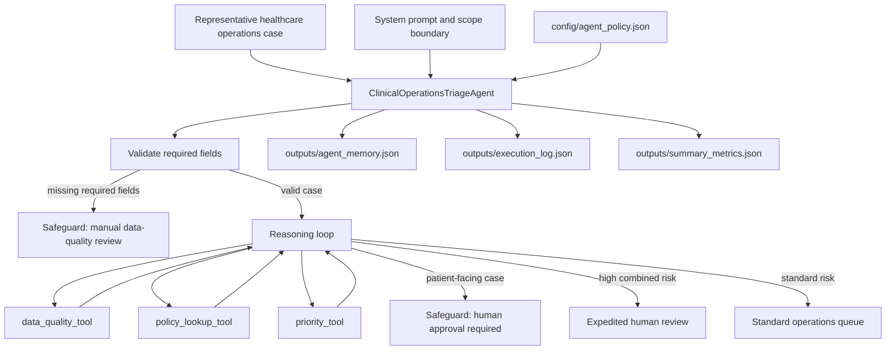

# Agentic Workflow Architecture Diagram

Author: Sukh Sandhu

This diagram documents the agent components, reasoning flow, memory/state handling, tool interactions, and safeguards used by the submitted `agentic_system.py` workflow.

## Component Roles

- `ClinicalOperationsTriageAgent` coordinates validation, reasoning, tool calls, memory updates, and final routing.
- `data_quality_tool` checks missing fields and estimates data-quality risk.
- `policy_lookup_tool` enforces the patient-facing boundary.
- `priority_tool` combines risk score, confidence gap, and data-quality risk into a routing signal.
- `AgentMemory` persists observed case decisions to `outputs/agent_memory.json`.
- `outputs/execution_log.json` records the trace of tool observations and decisions for review.

## Safeguards

- Missing required fields stop normal routing and trigger manual data-quality review.
- Patient-facing cases cannot be finalized automatically and require human approval.
- Tool observations are written into the execution trace so decisions remain auditable.
- The implementation is intentionally bounded to routing support and does not make clinical diagnoses or treatment recommendations.
